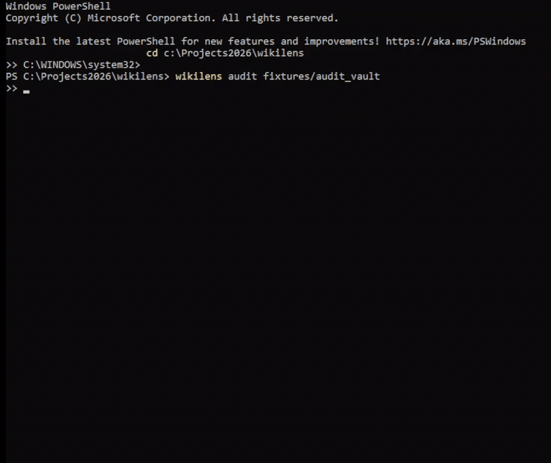

# wikilens

[](https://pypi.org/project/wikilens/)
[](https://github.com/Universe8888/wikilens/actions/workflows/ci.yml)
[](https://pypi.org/project/wikilens/)
[](./LICENSE)
[](.github/workflows/ci.yml)

8 evaluated agents, one command, any Markdown vault — turning a folder of notes into a queryable, auditable, self-aware knowledge system.

**Status:** Pre-1.0 · 8 agents shipped, 6 with hand-labeled evals (`drift` and `concepts` have eval harnesses + targets but no published run yet). [See full per-run benchmark history →](./BENCHMARK.md)



<sup>`audit` runs offline in under a second — no index, no model, no API key. Reproduce the recording with `demo.tape` (vhs).</sup>

---

## Agents

Scores are **observed ranges across the runs logged in [`BENCHMARK.md`](./BENCHMARK.md)**, not
best-case cherry-picks. Where a single number is shown, runs are consistent; where a range is
shown, the result varies by judge model, threshold, or config, and the spread is reported honestly.

| Command | What it finds | Measured (see BENCHMARK.md) |
|---------|--------------|------------------------------|
| `audit` | Broken wikilinks, one-way links, orphan notes, shadowed basenames | **F1 = 1.00** (deterministic graph scan, no model) |
| `query` | Semantic search over the indexed vault | **Hit@5 = 1.00**, Recall@5 0.97–1.00 (20-query set) |
| `contradict` | Contradicting claim pairs across notes | **F1 = 0.82** overall (factual 0.84 · temporal 0.67) |
| `confidence` | Claims below an epistemic threshold (5-level scale) | **F1 0.66–0.89** by judge/config; recall is the weak axis |
| `answer` | Drafts cited stub notes answering identified gaps | **Pass rate 0.40–0.80** (best 0.80); attribution 0.90–1.00 |
| `gap` | Unanswered questions implied by vault content | **Cluster recall = 1.00**, but matcher precision 0.19–0.48 (over-generates) |
| `drift` | Notes where beliefs shifted over git history | Harness + targets (P≥0.80, R≥0.80); **not yet benchmarked** |
| `concepts` | Clusters of notes circling an unnamed concept | Harness + target (F1≥0.70); **not yet benchmarked** |

### How to read these numbers

- **Eval sets are small** (16–249 items per fixture). These show the approach works on labeled
  ground truth; they are not yet large-scale guarantees. A 1,000+-note benchmark is on the roadmap.
- **LLM-judged agents vary by judge.** `confidence`, `answer`, and `gap` move with the judge model
  and threshold — the ranges above are real, and every run is timestamped in `BENCHMARK.md` so
  regressions are visible side-by-side.
- **Known weak spots, stated plainly:** `gap` over-generates (high recall, low precision — it
  proposes more questions than the gold set, so it errs toward surfacing too much rather than
  missing things); `confidence` recall lags precision; `drift`/`concepts` have harnesses but no
  published numbers yet. These are tracked in [`ROADMAP.md`](./ROADMAP.md).

If a metric can't be reproduced from a fresh clone via `make benchmark` (or the per-agent eval
scripts with a judge key), it doesn't belong in this table.

---

## See it run

`audit` needs no index, no model download, and no API key — it's a pure-function
graph scan over the vault. Point it at the bundled fixture and you get a report like
this in under a second:

```console
$ wikilens audit fixtures/audit_vault
# Link audit — audit_vault

Scanned 16 notes. 19 findings.

## Broken links (4)
- `jupiter` → `great-red-spot` [[...]]
- `mars` → `pluto` [[...]]
- `solo-comet` → `nonexistent-meteor` [[...]]
- `telescopes` → `hubble` ![[...]]

## One-way links (8)
- `asteroids` → `mars` (no backlink)
- `drifter` → `mars` (no backlink)
- `ideas-overview` → `journal/ideas` (no backlink)
- `ideas-overview` → `notes/ideas` (no backlink)
- `lonely-rock` → `asteroids` (no backlink)
- `mercury` → `venus` (no backlink)
- `telescopes` → `jupiter` (no backlink)
- `venus` → `mars` (no backlink)

## Orphan notes (6)
- `drifter` (1 outbound, 0 inbound)
- `ideas-overview` (1 outbound, 0 inbound)
- `lonely-rock` (1 outbound, 0 inbound)
- `mercury` (1 outbound, 0 inbound)
- `solo-comet` (1 outbound, 0 inbound)
- `telescopes` (2 outbound, 0 inbound)

## Shadowed links (1)
- `ideas-overview` → `ideas` (candidates: `journal/ideas`, `notes/ideas`)
```

Exit code is `1` when findings are reported (`0` when clean) — so `audit` doubles as a
pre-commit / CI gate.

---

## What it is

`wikilens` turns a folder of Markdown notes (an Obsidian vault, a Zettelkasten, any personal knowledge base) into a queryable, auditable, self-aware knowledge system.

It is:

- **Local-first.** Runs on your machine. Your notes never leave unless you explicitly call a remote LLM.
- **Agent-based.** Individual capabilities are isolated agents with measured performance.
- **Evaluated, not vibes.** Every shipped agent has a labeled test fixture and a reported score — including the runs where it underperforms.
- **Markdown-native.** Understands Obsidian-flavored syntax: `[[wikilinks]]`, YAML frontmatter, callouts, embeds.

It is not:

- A hosted SaaS (v1 is local only)
- A note editor (bring your own — Obsidian, VS Code, plain text)
- A chatbot wrapper ("chat with your notes" is table stakes; this is the layer above that)

---

## Quickstart

```bash
pip install wikilens
wikilens ingest /path/to/vault
wikilens audit /path/to/vault
```

---

## Install

```bash
pip install wikilens
```

Python 3.12+ is required. The first run of `ingest` or `query` downloads two
local models (~270 MB total, cached for all subsequent runs):
`BAAI/bge-small-en-v1.5` (embedder) and `BAAI/bge-reranker-base` (reranker).

For `contradict`, `gap`, `answer`, `drift`, `concepts`, and `confidence` you also need a remote LLM key:

```bash
pip install 'wikilens[judge]'         # adds openai, anthropic, scikit-learn
export OPENAI_API_KEY=sk-...          # or ANTHROPIC_API_KEY for --judge claude
```

LLM backends are bring-your-own-key; OpenAI (`gpt-4o`) is the default, Claude is available via `--judge claude`.

**From source** (dev / contributor install):

```bash
git clone https://github.com/Universe8888/wikilens.git
cd wikilens
pip install -e '.[dev]'
```

On Windows, if the `wikilens` command is not found after install, add the
Python Scripts directory to `PATH` (e.g. `%APPDATA%\Python\Python312\Scripts`)
or run `python -m wikilens.cli` while developing.

---

## Usage

All LLM commands support `--workers N` for parallel execution, `--max-cost $`
for a hard budget cap, and `--no-cache` to bypass the verdict cache. A warm
re-run with an unchanged vault costs zero API calls (cached verdicts replay).

```bash
# Build the index (full rebuild each run; incremental is deferred).
wikilens ingest ./my-vault

# Query — four retrieval modes are supported.
wikilens query "how do plants turn light into sugar"            # default: rerank
wikilens query "..." --mode dense                               # cosine only
wikilens query "..." --mode bm25                                # FTS / BM25 only
wikilens query "..." --mode hybrid                              # RRF fusion
wikilens query "..." --mode rerank -k 10                        # top-k after rerank

# Audit — find broken, one-way, orphan, and shadowed wikilinks.
wikilens audit ./my-vault                                       # markdown report
wikilens audit ./my-vault --json                                # machine-readable
wikilens audit ./my-vault --only broken,orphan                  # filter classes
```

`audit` exits 0 when clean, 1 when any finding is reported — so it doubles as
a pre-commit / CI gate. Index defaults to `.wikilens/db` inside the current
directory; override with `--db <path>`.

```bash
# Contradict — find conflicting chunk pairs.
pip install -e '.[judge]'
wikilens contradict ./my-vault --judge openai                   # full run
wikilens contradict ./my-vault --judge none                     # dry-run (no API)
wikilens contradict ./my-vault --judge openai --sample 20       # cap API calls

# Gap — find unanswered questions the vault implies but doesn't answer.
wikilens gap ./my-vault --judge openai                          # full run
wikilens gap ./my-vault --judge none                            # dry-run (no API)
wikilens gap ./my-vault --judge openai --max-clusters 10        # budget cap
wikilens gap ./my-vault --judge openai --top-gaps-per-cluster 2 # fewer per cluster

# Answer — for each gap, retrieve vault evidence and draft a note stub.
wikilens gap ./my-vault --judge openai --json > gaps.json       # generate gaps first
wikilens answer ./my-vault --gaps gaps.json --judge openai      # draft stubs to stdout
wikilens answer ./my-vault --gaps gaps.json --judge openai \
    --write --out ./stubs/                                      # write .md files
wikilens answer ./my-vault --gaps gaps.json --judge none        # dry-run (no API)
```

`contradict`, `gap`, and `answer` exit 0 when clean, 1 when findings / partial
coverage reported, 2 on budget-exceeded or bad input. Set `OPENAI_API_KEY`
(or `ANTHROPIC_API_KEY` for `--judge claude`) in your shell or `.env`.

```bash
# Parallelism and cost control (all LLM commands):
wikilens contradict ./my-vault --judge openai --workers 8    # 8 concurrent calls
wikilens gap ./my-vault --judge openai --max-cost 2.00       # hard $2 ceiling
wikilens confidence ./my-vault --judge openai --no-cache     # bypass cache
```

```bash
# Drift — surface notes where beliefs shifted over the vault's git history.
wikilens drift ./my-vault                              # full history, OpenAI judge
wikilens drift ./my-vault --judge none                 # dry-run (no API)
wikilens drift ./my-vault --judge openai --sample 20   # cap API calls
wikilens drift ./my-vault --json                       # machine-readable output
wikilens drift ./my-vault --only chemistry.md          # restrict to one note
wikilens drift ./my-vault --granularity paragraph      # coarser claim units
```

`drift` requires the vault to be inside a git repository. Exit 0 when no
drift found, 1 when findings reported, 2 on bad input or missing git repo.
Known limitation: `--since` is parsed but not yet applied to `git log`
(fix deferred). Heavy renames / file splits are not tracked (`git log --follow`
limitation).

```bash
# Concepts — detect clusters of notes circling an unnamed concept.
wikilens concepts ./my-vault --judge openai
wikilens concepts ./my-vault --judge none              # dry-run (no API)

# Confidence — flag claims below an epistemic threshold.
wikilens confidence ./my-vault --judge openai
wikilens confidence ./my-vault --threshold 3           # stricter threshold (1–5 scale)
wikilens confidence ./my-vault --judge none            # dry-run (no API)
```

---

## Benchmark

Full tables and per-run history in [`BENCHMARK.md`](./BENCHMARK.md). Every run is timestamped and
appended (never overwritten), so regressions are visible side-by-side. Reproduce any suite:

```bash
make lint
make typecheck
make test
make benchmark
```

`make benchmark` uses no-API mock judges for P4-P6 by default. To reproduce
published LLM-judged numbers, run the individual eval scripts with
`--judge openai` or `--judge claude` after setting the relevant API key.

---

## Design principles

1. **No silent steps.** Every agent explains what it did and why.
2. **Reproducible evaluation.** `make benchmark` produces the numbers in `BENCHMARK.md` — including the bad runs.
3. **No vendor lock.** Swappable embeddings, swappable LLMs, swappable vector stores.
4. **Fail loud.** Broken inputs are surfaced, never guessed.

---

## Roadmap

Full phase list, launch hooks, and eval targets in [`ROADMAP.md`](./ROADMAP.md).

---

## Versioning

wikilens is pre-1.0. Minor version bumps may include CLI and schema changes; see CHANGELOG.

---

## License

MIT — see [LICENSE](./LICENSE).

## Author

Built by [Boris Manzov](https://github.com/Universe8888). Feedback and ideas welcome in [Issues](https://github.com/Universe8888/wikilens/issues).
